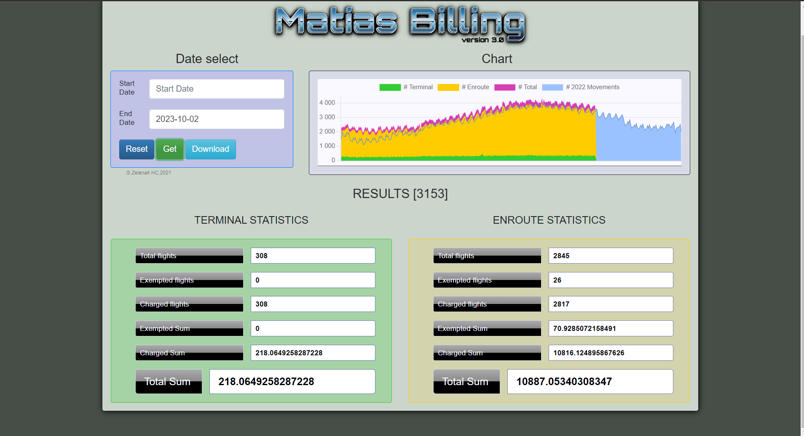
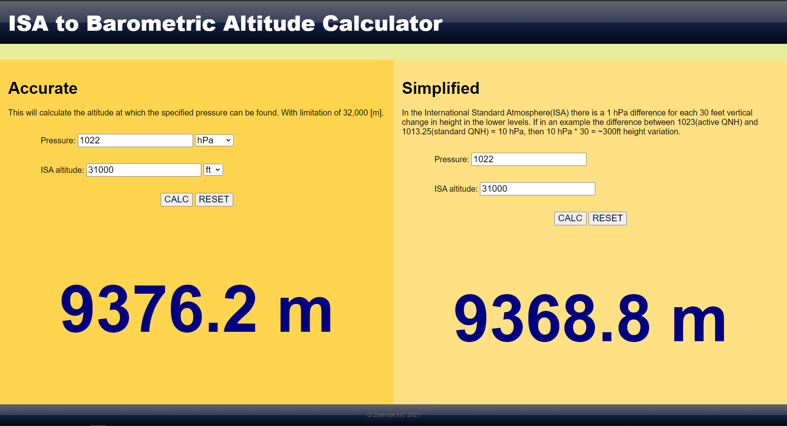
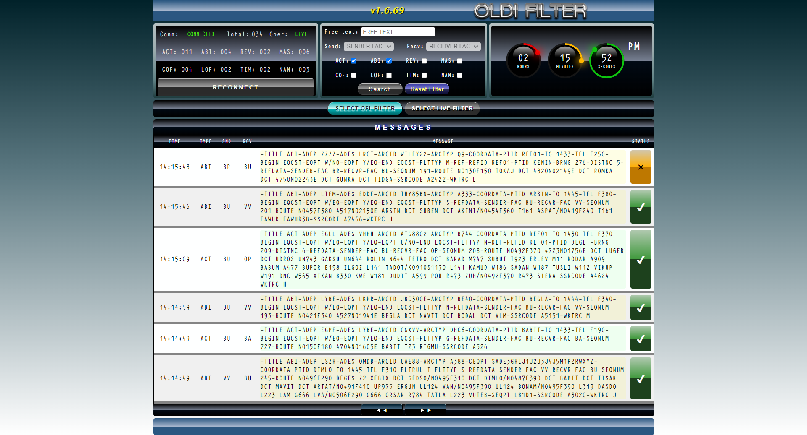
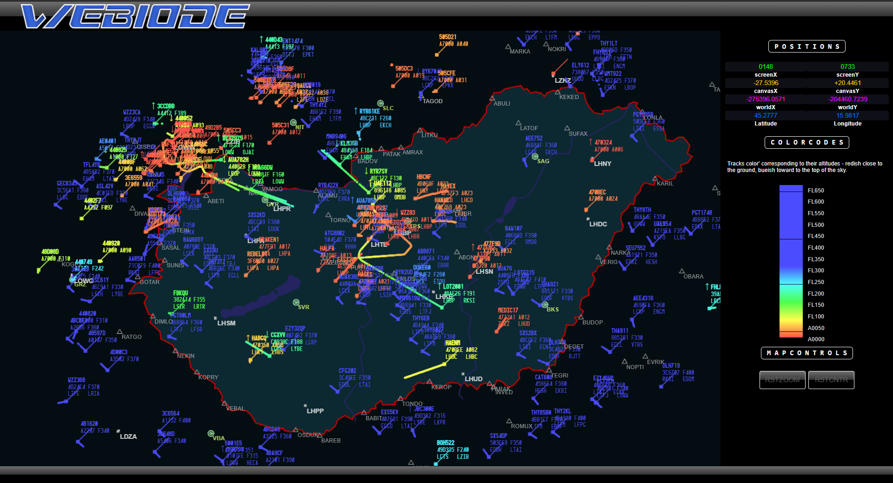

- 👋 Hi, I’m @eurocat2k
- 👀 I’m interested in Air Traffic Control system administration...
- 🌱 I’m currently coding various utilities and applications related to the ATM industry ...
- 📫 How to reach me: [email](mailto:gabor.zelenak@hungarocontrol.hu) ...

### Gists and else...
- Dynamic Vector DataType and Library in C [here](https://gist.github.com/eurocat2k/66f58fc608f170c98c2f09224e0d0f01)

### Working experiences
- Technical Supervisor @LRI, Budapest [**1998-2000**]

  I was involved in developing Eurocat ATM system (later MATIAS based on S2K core product) systems with
  AirSys ATM in Chessington UK. As a technical supervisor I was responsible for monitoring and controlling the ATM operational system.
  
- ATM System Administrator @LRI/HungaroControl, Budapest [**2000-Present**]

  As an ATM system administrator I provide technical support for the operational and technical staff. I actively
  participate in development and site integration of the ATM system and other supporting operational systems.
  In cooperation with ATM System Development Department and Thales System I am responsible for data
  collection, data analyzing, bug tracing and reporting. As an ATM system administrator expert I participate new
  back‑up ATM system (Polaris) development and integration in cooperation with Tern Systems.
  I also work in close cooperation with ATM Operational personnel: AIRAC, off‑line parameter database update
  management ‑ backup and restore on demand.
  I support other departments ‑ HR, Controlling, ATM OPS Room ‑ with various software tools that I have
  developed:
    - OLDI messages filter for flight data officers 
    - digital navigation tool for FISO and ATCO selection
    - Route charge calculator for Controlling Department
    - Open Glider Network FLARM ‑ data proxy for the backup system,
    - Flight Plan Data Proxy - for backup systems,
    - Radar Data Proxy - for backup systems and various internal applications,
    - Radar Data Converter for synthetic training device
  
  I develop with the following computer programming languages:
    - C ‑ expert [backend/tools/drivers/servers]
    - Perl ‑ intermediate [backend/tools]
    - NodeJS ‑ intermediate [frontend/backend]
    - PHP, HTML, CSS ‑ intermediate [frontend]

- ATSEP OJTI and classroom instructor @HungaroControl, Budapest [**2006-Present**]

  As an instructor my responsibility is to develop training material to be delivered in (virtual)classroom and
  on‑the‑job training to support the students to thrive. I also deliver refresher courses to ATM system technical 
  staff to stay current.
  
- ATSEP Assessor @HungaroControl, Budapest [**2006-Present**]

  As an assessor I deliver competency checks for ATM technical staff ‑ supervisors and maintenance personnel.
  
- Skills
  
  **Unix** (*xBSD: FreeBSD, NetBSD, OpenBSD*) tools/programming/integartion experienced
  
  **Linux**-es (Slackware, Red-Hat, Ubuntu) tools/programming/integration intermediate
  
  **MS operational systems and applications** tools/integration intermediate
  
  **System programming in C language** expert
  
  **Holistic approach to ATM Systems/Simulator** expert

### Sample projects

  

    
    
Route Charge Application's Web UI

  

  

    
    
Altitude Calculator Application's Web UI

  

  

    
    
OLDI Filter Application's Web UI

  

  

    
    
Radar Window Application's Web UI

  

