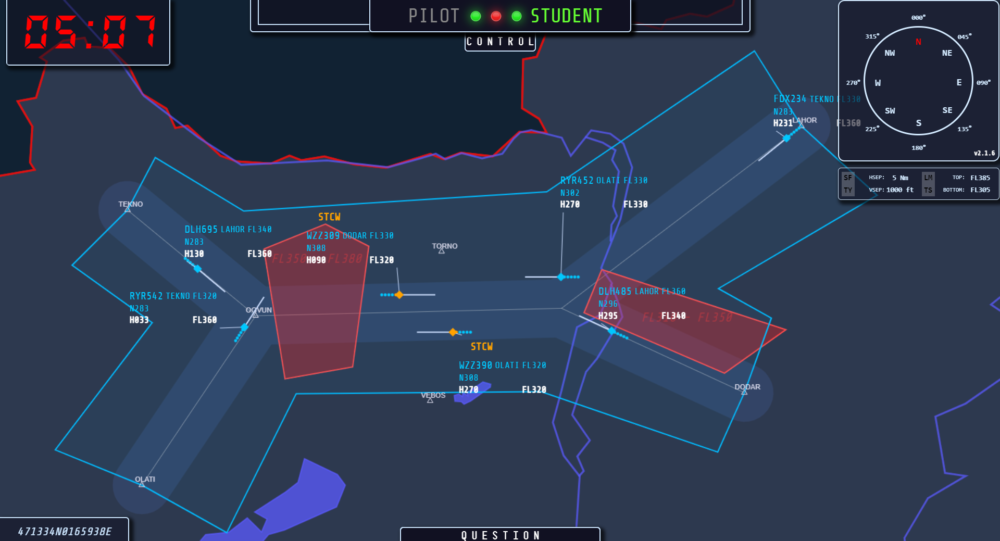

- 👋 Hi, I’m @eurocat2k [*Gabor Zelenak*]
- 👀 I’m interested in Air Traffic Control system administration and system programming...
- 🌱 I’m currently coding various utilities and applications related to the ATM industry [C,Ada,NodeJS,PHP,Perl]...
- 📫 How to reach me: [email](mailto:gabor.zelenak@hungarocontrol.hu) ...

### Gists and else...
- Dynamic Vector DataType and Library in C [here](https://gist.github.com/eurocat2k/66f58fc608f170c98c2f09224e0d0f01)
- C pointer check [here](https://gist.github.com/eurocat2k/494095ed5dd0fa7c5fc1d34aeba2a745)
- Public [Gists](https://gist.github.com/eurocat2k/) 

### Working experiences
- Technical Supervisor @LRI, Budapest [**1998-2000**]

  I was involved in developing Eurocat ATM system (later MATIAS based on S2K core product) systems with
  AirSys ATM in Chessington UK. As a technical supervisor I was responsible for monitoring and controlling the ATM operational system.
  
- ATM System Administrator @LRI/HungaroControl, Budapest [**2000-Present**]

  As an ATM system administrator I provide technical support for the operational and technical staff. I actively
  participate in development and site integration of the ATM system and other supporting operational systems.
  In cooperation with ATM System Development Department and Thales System I am responsible for data
  collection, data analyzing, bug tracing and reporting. As an ATM system administrator expert I participate new
  back‑up ATM system (Polaris) development and integration in cooperation with Tern Systems.
  I also work in close cooperation with ATM Operational personnel: AIRAC, off‑line parameter database update
  management ‑ backup and restore on demand.
  I support other departments ‑ HR, Controlling, ATM OPS Room ‑ with various software tools that I have
  developed:
    - OLDI messages filter for flight data officers (NodeJS)
    - digital navigation tool for FISO and ATCO selection (NodeJS,C)
    - Route charge calculator for Controlling Department (C,JS,Perl)
    - Open Glider Network FLARM ‑ data proxy for the backup system (C),
    - Flight Plan Data Proxy - for backup systems (C),
    - Radar Data Proxy - for backup systems and various internal applications,
    - Radar Data Converter for synthetic training device (C,Ada),
    - Radar Data Converter for backup systems (C),
    - QNH data service - METAR/TAF etc. parser (C,Ada),
    - interactive FIS Information Pages - (HTML,JS,CSS)
  
  I develop with the following computer programming languages:
    - C ‑ expert [backend/tools/drivers/servers]
    - Perl ‑ intermediate [backend/tools]
    - NodeJS ‑ intermediate [frontend/backend]
    - PHP, HTML, CSS ‑ intermediate [frontend]
    - Ada - advanced [backend]

- ATSEP OJTI and classroom instructor @HungaroControl, Budapest [**2006-Present**]

  As an instructor my responsibility is to develop training material to be delivered in (virtual)classroom and
  on‑the‑job training to support the students to thrive. I also deliver refresher courses to ATM system technical 
  staff to stay current.
  
- ATSEP Assessor @HungaroControl, Budapest [**2006-Present**]

  As an assessor I deliver competency checks for ATM technical staff ‑ supervisors and maintenance personnel.
  
- Skills
  
  **Unix** (*xBSD: FreeBSD, NetBSD, OpenBSD*) tools/programming/integartion experienced
  
  **Linux**-es (Slackware, Red-Hat, Ubuntu) tools/programming/integration intermediate
  
  **MS operational systems and applications** tools/integration intermediate
  
  **System programming in C language** expert
  
  **Holistic approach to ATM Systems/Simulator** expert

### Sample projects

  

    
Route Charge Application's Web UI

    
  

  

    
Altitude Calculator Application's Web UI

    
  

  

    
OLDI Filter Application's Web UI

    
  

  

    
Radar Window Application's Web UI

    
  

  

    
Digital Navigation Tool: MAP

    
    
Digital Navigation Tool: SECRET

    
    
Digital Navigation Tool: FIRST TRACKS AND MATH

    
    
Digital Navigation Tool: CALL EVENT

    
    
Digital Navigation Tool: TRACK ENTERS DZ

    
    
Digital Navigation Tool: PREACTIVATED DZ AT EAST

    
    
Digital Navigation Tool: DAIW ALERT

    
    
Digital Navigation Tool: STCW - WARNING BEFORE STCA OCCURS

    
    
Digital Navigation Tool: TRACKS DIVERTED FROM ROUTE

    
    
Digital Navigation Tool: SIMULATION END, WAITING FOR THE SECRET CODE

    
    
Digital Navigation Tool: SECRET CODE ENTERED

    
    
Digital Navigation Tool: CHECK USER INPUT AGAINST ORIGIAL SECRET CODE

    
    
Digital Navigation Tool: SUMMARIZE ALL EVENTS AT THE CLOSING WINDOW

    
  

